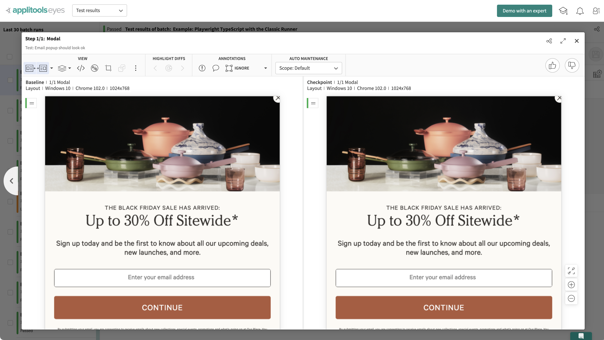
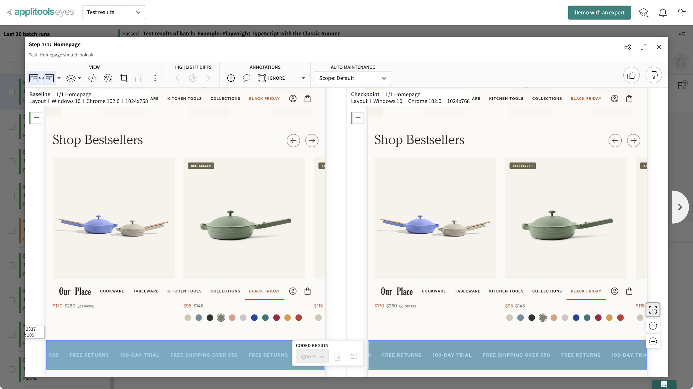

# Playwright POCs for Redirects and Applitools Visual Testing

It uses:

* [TypeScript](https://www.typescriptlang.org/) as the programming language
* [Playwright](https://playwright.dev/) for browser automation
* [Playwright Test](https://playwright.dev/docs/api/class-test) as the core test framework
* [Chromium](https://www.chromium.org/chromium-projects/) as the local browser for testing
* [npm](https://www.npmjs.com/) for dependency management
* [Applitools Eyes](https://applitools.com/platform/eyes/) for visual testing
* [Airtable](https://airtable.com/) for test data

To run this example project, you'll need:
1. A recent version of [Node.js](https://nodejs.org/en/download/)
2. An [Applitools account](https://auth.applitools.com/users/register), which you can register for free
3. An [Airtable](https://airtable.com/) account with a base set up to resemble:

| Original | Redirect |
| --- | --- |
| /collections/bf-sale | /collections/black-friday-sale |
| /collections/fall-hard-sale | /collections/black-friday-sale |
 

To install dependencies and set up Playwright, run:

```
npm install
npx playwright install
```

## Tests
### Applitools Visual Testing
There are two test cases included in [`homepage.spec.ts`](tests/homepage.spec.ts).
Note: To run these tests, you will need to set the `APPLITOOLS_API_KEY` environment variable.

1. Test: Email popup should look ok

* This test navigates to the homepage and does an Applitools Eyes visual check on the modal that displays on the homepage. 
* This case demonstrates how Applitools can be used to perform a snapshot check on one element, while excluding the rest of the page.


2. Test: Homepage should look ok

* This test navigates to the homepage, waits for the modal to appear, closes it, and does an Applitools Eyes visual check on the entirety of the homepage. 
* This case demonstrates how Applitools can use its [layout match level](https://applitools.com/docs/common/cmn-eyes-match-levels.html) to ignore changes in text content, graphics, and color to alert only when element layout shifts have been introduced.
* It also demonstrates the use of [coded ignore regions](https://help.applitools.com/hc/en-us/articles/360007188211-Coded-Ignore-Regions). On the page in the test, the site has a scrolling marquee banner. Typically, if this section was included in a snapshot test, the position of the text would be flagged as different from one test run to the next, causing it to fail every time. By ignoring the region, it is excluded from the visual comparison.


### Testing Redirects using Airtable

There is one test case in [`redirects.spec.ts`](tests/redirects.spec.ts).
Note: To run this test, you will need to specify your `AIRTABLE_API_KEY` and Airtable `BASE_ID` in the spec file.

1. Test: Redirects should work

* This test reads pairs of URL paths from Airtable. For each pair, it navigates to the first path in the pair, and checks to see if the browser resolves to the second path in the pair.
* This case demonstrates how external test data can be maintained and used in test cases, without having to make code changes to a test case itself. 
* In this case, since some URLs are used for seasonal marketing campaigns, it may be desirable to have a person on the marketing team keep track of which URLs should be redirected in a data source like Airtable. The list can grow or shrink, as long as the structure remains the same.


**To initiate the tests, run:**

```
npm test
```

**This project is derived from the Applitools 
[Playwright TypeScript tutorial](https://applitools.com/tutorials/quickstart/web/playwright/typescript) and [Applitools Tutorial: Playwright TypeScript with the Classic Runner](https://github.com/applitools/example-playwright-typescript-classic)**
